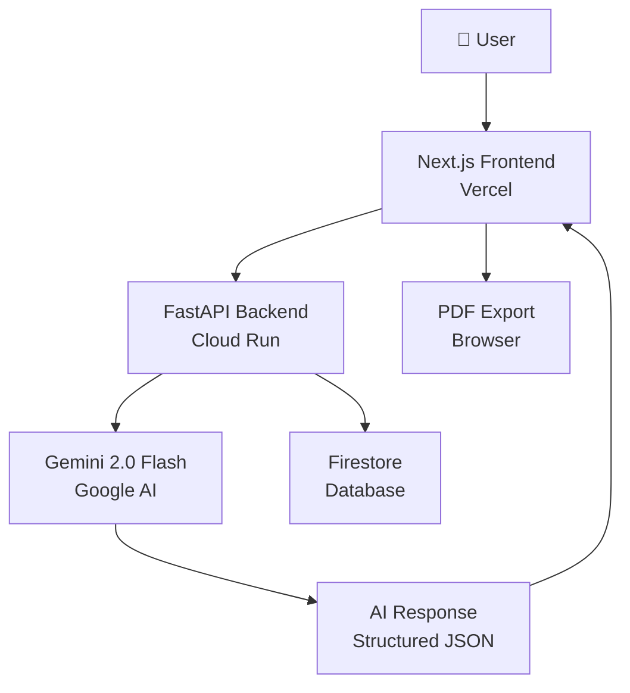

# AI Resume Builder 🤖

> **Generate tailored, ATS-optimized resumes in seconds using Google Gemini AI**

[](https://ai-resume-builder.vercel.app)
[](https://github.com/Anxhutek/ai-resume-builder)
[](https://ai.google.dev)
[](https://cloud.google.com/run)

---

## 🎯 Problem

Job seekers spend **3-5 hours** tailoring each resume for different positions. Most resumes fail ATS screening before a human ever reads them — resulting in qualified candidates being rejected automatically.

## 💡 Solution

**AI Resume Builder** uses Google Gemini 2.0 Flash to:
1. Analyze any job description and extract key requirements
2. Generate a fully tailored, ATS-optimized resume in **< 30 seconds**
3. Provide an **ATS Match Score** showing how well your resume fits the job
4. Improve individual sections with one click
5. Generate personalized cover letters instantly

## 🤖 AI Integration

| Feature | Model | Description |
|---------|-------|-------------|
| Resume Generation | Gemini 2.0 Flash | Full resume tailored to job description |
| ATS Optimization | Gemini 2.0 Flash | Keyword extraction + match scoring |
| Section Improvement | Gemini 2.0 Flash | AI-powered bullet point enhancement |
| Cover Letter | Gemini 2.0 Flash | Personalized cover letter generation |
| Streaming | Gemini 2.0 Flash | Real-time generation with SSE |

## 🏗️ Architecture



## 🚀 Quick Start

```bash
# Clone
git clone https://github.com/Anxhutek/ai-resume-builder
cd ai-resume-builder

# Backend
cd backend
pip install -r requirements.txt
cp .env.example .env
# Add your GEMINI_API_KEY to .env
uvicorn app.main:app --reload --port 8080

# Frontend (new terminal)
cd frontend
npm install
npm run dev
```

## 🛠️ Tech Stack

| Layer | Technology |
|-------|-----------|
| Frontend | Next.js 14, Tailwind CSS, shadcn/ui |
| Backend | FastAPI, Python 3.11 |
| AI | Google Gemini 2.0 Flash |
| Database | Google Firestore |
| Deployment | Vercel (FE) + Google Cloud Run (BE) |
| CI/CD | GitHub Actions |

## 📊 AI Usage Evidence

- 📋 [PROMPTS.md](./PROMPTS.md) — Every AI prompt used during development
- 🤖 [AI_USAGE.md](./AI_USAGE.md) — Complete AI usage log
- 🏗️ [ARCHITECTURE.md](./ARCHITECTURE.md) — System design

## 🔗 Links

- **Live App:** https://ai-resume-builder.vercel.app
- **API Docs:** https://api.ai-resume-builder.run.app/docs
- **GitHub:** https://github.com/Anxhutek/ai-resume-builder

## 📄 License

MIT License — See [LICENSE](./LICENSE)
